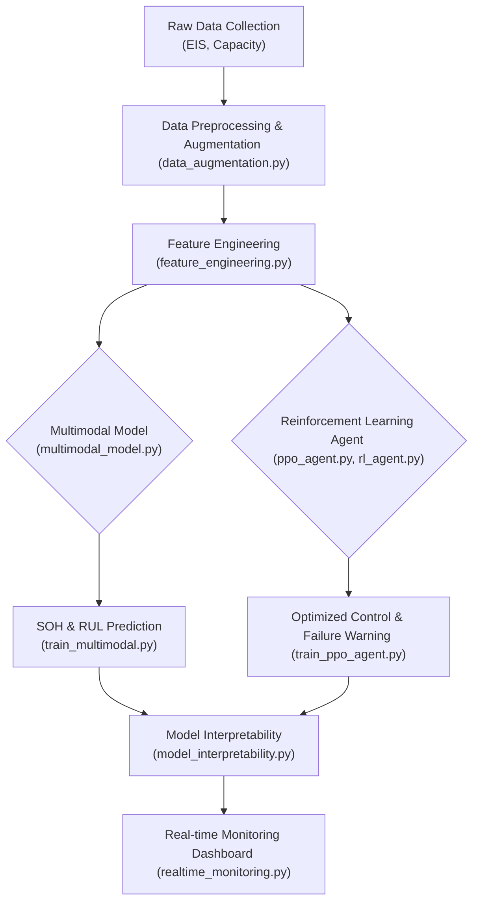

# Battery Health & Failure Predictor using Multimodal Data and Reinforcement Learning
## 基于多模态数据与强化学习的电池健康状态预测与故障预警系统

---

## Project Overview / 项目概述

This project provides an advanced framework for predicting the State of Health (SOH) and Remaining Useful Life (RUL) of lithium-ion batteries. It leverages multimodal data, including Electrochemical Impedance Spectroscopy (EIS) and capacity measurements, to build a robust predictive model. A Reinforcement Learning (RL) agent is also integrated to optimize battery management strategies and enhance early failure detection, moving beyond traditional statistical methods. The project's core objective is to create a highly accurate, interpretable, and proactive battery management system suitable for critical applications like electric vehicles and energy storage systems.

本项目构建了一个先进的锂离子电池健康状态（SOH）与剩余使用寿命（RUL）预测框架。通过融合电化学阻抗谱（EIS）和容量测量等多模态数据，建立了一个鲁棒的预测模型。此外，项目创新性地集成了一个强化学习（RL）代理，用于优化电池管理策略并增强早期故障检测能力，超越了传统的统计学方法。项目的核心目标是创建一个高精度、可解释且具备前瞻性的电池管理系统，适用于电动汽车和储能系统等关键领域。

---

## Key Features / 项目亮点

*   **Multimodal Data Fusion**: Integrates EIS and historical capacity data to create a comprehensive health profile of the battery, capturing both internal electrochemical states and long-term degradation trends.
*   **Deep Learning Models**: Employs sophisticated neural networks (e.g., LSTM, Transformer) to model the complex temporal dependencies in battery data.
*   **Reinforcement Learning Agent**: Utilizes a Proximal Policy Optimization (PPO) agent to simulate battery operation strategies and predict failures under various conditions, enabling proactive maintenance.
*   **Model Interpretability**: Incorporates techniques like SHAP (SHapley Additive exPlanations) to explain model predictions, building trust and providing actionable insights.
*   **Real-time Monitoring Simulation**: A simulated environment to demonstrate the model's capability in real-time SOH tracking and alerting.

*   **多模态数据融合**: 结合EIS和历史容量数据，为电池创建一个全面的健康画像，同时捕捉内部电化学状态和长期退化趋势。
*   **深度学习模型**: 采用先进的神经网络（如LSTM、Transformer）对电池数据中复杂的时间依赖性进行建模。
*   **强化学习代理**: 利用近端策略优化（PPO）代理来模拟电池在不同工况下的运行策略，并预测潜在的故障，从而实现主动式维护。
*   **模型可解释性**: 集成SHAP（SHapley Additive exPlanations）等技术来解释模型预测，建立对模型的信任并提供可行的见解。
*   **实时监控仿真**: 通过仿真环境展示模型在实时SOH跟踪和预警方面的能力。

---

## System Architecture / 系统架构

The project's workflow is structured as follows:
项目工作流程如下：



---

## Data Description / 数据说明

The dataset is organized by battery ID (e.g., `B01`, `B02`, ...) and contains two main types of measurements:
-   **Capacity Measurements**: Time-series data recording the degradation of battery capacity over charge-discharge cycles.
    -   Location: `data/BXX/Capacity measurements/`
-   **EIS Measurements**: Impedance data collected at various States of Charge (SoC), providing insights into the battery's internal resistance and electrochemical properties.
    -   Location: `data/BXX/EIS measurements/Test_Y/Hioki/`
These datasets form the basis for our multimodal approach. `generate_dummy_data.py` is also available for generating synthetic data for testing purposes.

数据集按电池ID（例如 `B01`, `B02`, ...）进行组织，包含两种主要的测量类型：
-   **容量测量**: 记录电池容量在充放电循环中衰退的时间序列数据。
    -   位置: `data/BXX/Capacity measurements/`
-   **EIS测量**: 在不同充电状态（SoC）下采集的阻抗数据，提供了关于电池内阻和电化学特性的深刻见解。
    -   位置: `data/BXX/EIS measurements/Test_Y/Hioki/`
这些数据集是我们多模态方法的基础。项目还提供了 `generate_dummy_data.py` 用于生成测试所需的模拟数据。

---

## Models & Methodology / 模型与方法

### 1. Data Engineering / 数据工程
-   **Preprocessing**: Raw data files are parsed, cleaned, and synchronized. Missing values are handled through imputation.
-   **Feature Extraction**: Key features are extracted from EIS spectra (e.g., ohmic resistance, charge transfer resistance) and capacity curves (e.g., slope, variance).
-   **Data Augmentation (`data_augmentation.py`)**: Techniques are applied to generate additional training samples, improving model generalization.

-   **预处理**: 解析、清洗和同步原始数据文件。通过插值法处理缺失值。
-   **特征提取**: 从EIS谱（如欧姆内阻、电荷转移电阻）和容量衰退曲线（如斜率、方差）中提取关键特征。
-   **数据增强 (`data_augmentation.py`)**: 应用多种技术生成额外的训练样本，以提高模型的泛化能力。

### 2. Multimodal Predictive Model (`multimodal_model.py`) / 多模态预测模型
A custom neural network architecture is designed to accept both EIS features and capacity time-series data. It uses attention mechanisms to weigh the importance of different features and time steps, leading to more accurate SOH predictions.

我们设计了一个定制的神经网络架构，可以同时接受EIS特征和容量时间序列数据。该模型利用注意力机制来权衡不同特征和时间步的重要性，从而实现更精确的SOH预测。

### 3. Reinforcement Learning Agent (`ppo_agent.py`) / 强化学习代理
We model the battery's operational environment as a Markov Decision Process (MDP).
-   **State**: Current SOH, SoC, temperature, and load.
-   **Action**: Charge/discharge rate.
-   **Reward**: A function designed to maximize battery life while meeting performance demands.
The PPO agent learns an optimal policy to suggest operational parameters and raises an alarm if the predicted state trajectory leads to a high probability of failure.

我们将电池的运行环境建模为马尔可夫决策过程（MDP）。
-   **状态**: 当前的SOH、SoC、温度和负载。
-   **动作**: 充电/放电倍率。
-   **奖励**: 一个旨在最大化电池寿命同时满足性能需求的函数。
PPO代理学习一个最优策略，以建议操作参数，并在预测的状态轨迹导致高故障概率时发出警报。

### 4. Model Interpretability (`model_interpretability.py`) / 模型可解释性
To understand the "black box" nature of the models, we use SHAP to visualize which features are most influential in predicting battery failure. This is crucial for validating the model and for root cause analysis in real-world scenarios.

为了理解模型的“黑盒”特性，我们使用SHAP来可视化哪些特征在预测电池故障中最具影响力。这对于模型验证和在真实场景中进行根本原因分析至关重要。

---

## File Structure / 文件结构

The files intended for version control on GitHub are listed below. Note that the `data` directory, datasets, and generated models are excluded via `.gitignore`.
仓库中进行版本控制的文件结构如下。请注意，`data`目录、数据集和生成的模型通过`.gitignore`文件排除在版本控制之外。

```
.
├── .gitignore                        # Specifies which files/directories to ignore
├── LICENSE                           # The license for this project
├── README.md                         # This documentation file
├── requirements.txt                  # Project dependencies
│
├── main.py                           # Main script to orchestrate the workflow
│
├── battery_env.py                    # Defines the custom OpenAI Gym environment
├── data_augmentation.py              # Script for data augmentation
├── feature_engineering.py            # Script for feature extraction
├── generate_dummy_data.py            # Script to generate synthetic data for testing
│
├── model_interpretability.py         # Script for explaining model predictions
├── multimodal_model.py               # Definition of the multimodal deep learning model
├── ppo_agent.py                      # Implementation of the PPO agent
├── realtime_monitoring.py            # Simulation of a real-time monitoring system
├── rl_agent.py                       # Base class for Reinforcement Learning agents
│
├── train_multimodal.py               # Training script for the SOH prediction model
├── train_ppo_agent.py                # Training script for the PPO agent
└── train_reinforce_agent.py          # Alternative training script using REINFORCE
```

---

## Getting Started / 快速开始

### Prerequisites / 环境要求
-   Python 3.8+
-   Anaconda or Miniconda (recommended)

-   Python 3.8+
-   Anaconda 或 Miniconda (推荐)

### Installation / 安装
1.  **Clone the repository:**
    ```bash
    git clone https://github.com/lunazhang/Battery_Failure_Predictor.git
    cd Battery_Failure_Predictor
    ```

2.  **Create a conda environment and install dependencies:**
    ```bash
    conda create -n battery_env python=3.8
    conda activate battery_env
    pip install -r requirements.txt
    ```

### Usage / 使用
1.  **Data Preparation**:
    Place your raw battery data in the `data/` directory following the described structure.

    **准备数据**:
    将您的原始电池数据按照前述结构放入 `data/` 目录中。

2.  **Run the main pipeline**:
    Execute the main script to run the entire workflow, from data processing to model training and evaluation.
    ```bash
    python main.py
    ```

3.  **Run individual modules**:
    You can also run specific parts of the project, for example, to only train the multimodal model:
    ```bash
    python train_multimodal.py
    ```

---

## Future Work / 未来工作

-   **Hardware-in-the-loop (HIL) Testing**: Validate the RL agent's performance with a real battery management system.
-   **Advanced RL Algorithms**: Explore other algorithms like Soft Actor-Critic (SAC) for continuous control spaces.
-   **Cloud Deployment**: Deploy the monitoring system on a cloud platform (AWS/Azure/GCP) for scalable, real-world applications.
-   **Transfer Learning**: Develop models that can adapt to different battery chemistries and form factors with minimal retraining.

-   **硬件在环（HIL）测试**: 在真实的电池管理系统上验证强化学习代理的性能。
-   **先进的强化学习算法**: 探索如Soft Actor-Critic (SAC)等其他算法在连续控制空间中的应用。
-   **云端部署**: 将监控系统部署到云平台（AWS/Azure/GCP），以支持可扩展的实际应用。
-   **迁移学习**: 开发能够以最少的再训练成本适应不同电池化学体系和规格的模型。 